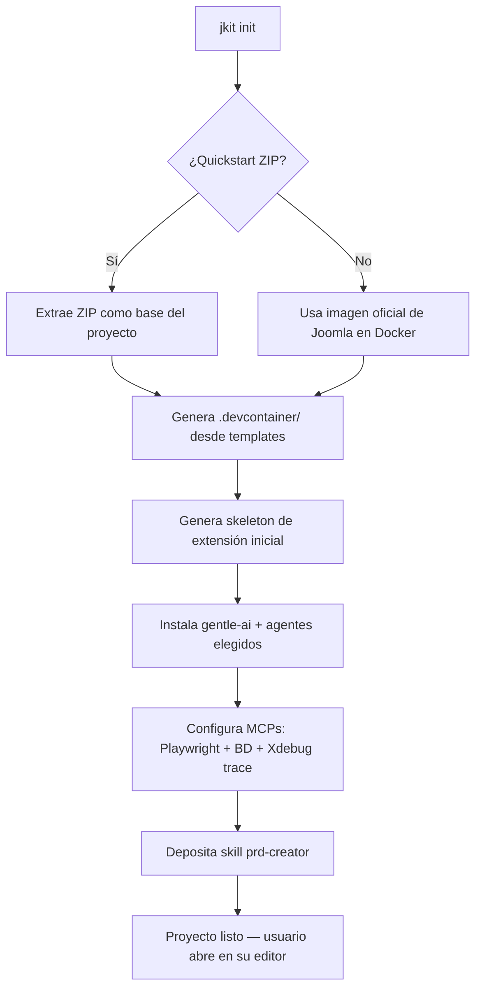

# JKit — Product Requirements Document

**Versión:** 0.1
**Fecha:** 2026-05-04
**Autor:** Alejandro Arroyave Valencia — alebak@ximware.com
**Estado:** Borrador activo

---

## 1. El Problema

> **Tagline:** JKit es una CLI que prepara un entorno de desarrollo moderno para extensiones de Joomla, integrando Dev Containers, agentes de codificación con IA y metodologías SDD/TDD/BDD.

Desarrollar extensiones para Joomla hoy en día sigue siendo un proceso manual, fragmentado y sin integración real con herramientas modernas. Las alternativas existentes (`joomla-gulp` —prácticamente deprecada y sin soporte para Joomla 4/5/6—, `JExt CLI`, `Akeeba Build Tools`, entre otras) resuelven partes del scaffolding o el build, pero ninguna ofrece:

- Un entorno reproducible basado en Dev Containers listo para usar.
- Integración con agentes de codificación (LLMs con tool use) vía `gentle-ai`.
- Soporte para Spec-Driven Development (SDD) combinado con TDD y BDD.
- Servidores MCP para que los agentes interactúen con el navegador, la base de datos y extensiones de terceros.

El resultado es que un desarrollador de Joomla que quiere aprovechar IA tiene que armar su entorno desde cero, pieza por pieza, cada vez que empieza un proyecto.

### Antes / Después

| Antes (sin JKit) | Después (con JKit) |
|---|---|
| Configurar manualmente Docker, Joomla, base de datos y scaffolding de extensión por proyecto | JKit genera la estructura del proyecto lista para abrir en cualquier editor o IDE (Dev Containers recomendado) |
| Sin integración de agentes IA en el flujo de desarrollo | Agentes de codificación conectados a MCPs listos desde el inicio vía `gentle-ai` |
| SDD/TDD/BDD como práctica aislada, sin scaffolding | `gentle-ai` toma el `PRD.md` del proyecto y orquesta el flujo completo |
| Interacción con extensiones de terceros sin protocolo estándar | MCPs propios para extensiones que lo soporten |
| Crear un sitio completo con IA requiere integración manual de herramientas | JKit orquesta la creación y gestión de contenido con agentes |

---

## 2. Quién es el usuario

### Usuario principal

**Desarrollador de extensiones para Joomla** que ya conoce el ecosistema y quiere adoptar un flujo moderno con IA y metodologías de desarrollo basadas en especificaciones.

**Perfil:**
- Conoce Joomla 5/6, PHP 8.x y Docker.
- Tiene experiencia o interés en TDD/BDD.
- Quiere usar agentes de codificación (Claude Code, OpenCode, Gemini CLI, etc.) pero no quiere armar la infraestructura desde cero.
- Puede desarrollar dentro o fuera de un Dev Container según su preferencia.
- Puede ser freelance, agencia digital o equipo interno.

### Usuario secundario

**Desarrollador o agencia que construye sitios Joomla con IA**, no necesariamente desarrollando extensiones propias, sino orquestando extensiones de terceros, gestionando contenido y parametrizando el CMS con agentes.

### Anti-usuario

- Desarrolladores que prefieren WordPress como plataforma base.
- Usuarios finales del CMS (no técnicos).

---

## 3. Qué hace (y qué NO hace)

### Hace

- Crea la estructura de un proyecto de extensión Joomla desde cero o desde un quickstart `.zip`.
- Genera la configuración `.devcontainer/` lista para usar: Joomla, MariaDB, phpMyAdmin, Mailpit y Xdebug preconfigurados.
- Instala `gentle-ai` como orquestador SDD en el entorno.
- Instala los agentes de codificación elegidos por el usuario (Claude Code, OpenCode, Gemini CLI, u otros soportados por `gentle-ai`).
- Deposita el skill `prd-creator` para que el usuario defina su `PRD.md` antes de empezar a desarrollar.
- Genera y gestiona skeletons de una o múltiples extensiones Joomla (componentes, módulos, plugins, plantillas, librerías, packages) dentro del mismo proyecto.
- Configura los servidores MCP disponibles (Playwright, MariaDB/MySQL y MCPs propios).
- Configura Xdebug en modo `trace`/`profile` para que los agentes lean los archivos generados como contexto de depuración.
- Empaqueta extensiones como `.zip` distribuibles en el directorio `builds/`.

### No hace

- No detecta ni lanza editores de código o IDEs.
- No instala extensiones de terceros en Joomla.
- No gestiona despliegues a producción o staging.
- No decide en qué directorio del agente instalar skills — esa responsabilidad es de `gentle-ai`.
- No genera specs ni tests — `gentle-ai` toma el `PRD.md` y lo hace.
- No genera código compatible con Joomla 3 o anteriores.

---

## 4. Cómo funciona (vista de alto nivel)

JKit tiene dos modos de entrada equivalentes en resultado:

**Modo interactivo** (como Vite):
```
$ jkit init
```
Lanza un asistente TUI que pregunta paso a paso: nombre del proyecto, imagen base de Joomla, agentes a instalar, tipo de extensión inicial, etc.

**Modo parametrizado** (automatizable, invocable por IA):
```
$ jkit init --name my-extension \
            --image joomla:6.1-php8.4-apache \
            --quickstart ./joomshaper-quickstart.zip \
            --agents claude,opencode
```
Si existe un `.zip` en el directorio actual sin `--quickstart`, JKit lo detecta automáticamente.

**Resultado en ambos casos:**



**Estructura del proyecto generado:**

```
my-joomla-project/
├── .devcontainer/
│   ├── devcontainer.json
│   ├── docker-compose.yml
│   ├── Dockerfile
│   ├── .env
│   ├── .env.example
│   ├── php-custom.ini
│   └── post-create.sh
├── administrator/
│   └── components/
│       └── com_myextension/
├── components/
│   └── com_myextension/
├── modules/
├── plugins/
├── templates/
├── builds/
│   └── com_myextension-1.0.0.zip
└── ...  ← resto de archivos de Joomla
```

**Agregar extensiones a un proyecto existente:**
```
$ jkit create component
$ jkit create module
$ jkit create plugin
$ jkit create template
$ jkit create library
$ jkit create package
```
Invocable por el usuario, por la IA vía chat o directamente por CLI.

---

## 5. Componentes / Arquitectura

**Estructura interna del repositorio de JKit:**

```
jkit/
├── .devcontainer/              # Entorno para desarrollar JKit (Go)
├── cmd/
│   └── jkit/
│       └── main.go
├── internal/
│   ├── init/                   # Lógica del comando jkit init
│   ├── generator/              # Scaffolding de extensiones Joomla
│   ├── agents/                 # Integración con gentle-ai y agentes
│   └── mcp/                    # Configuración de servidores MCP
├── templates/
│   ├── devcontainer/           # Templates del Dev Container para proyectos Joomla
│   ├── extensions/             # Skeletons de extensiones Joomla
│   │   ├── component/
│   │   ├── module/
│   │   ├── plugin/
│   │   ├── template/
│   │   ├── library/
│   │   └── package/
│   ├── agents/                 # Snippets bash por agente para post-create.sh
│   │   ├── claude.sh
│   │   ├── opencode.sh
│   │   └── gemini.sh
│   └── skills/
│       └── prd-creator/        # Skill agnóstico para crear/actualizar PRD.md
├── images.yaml                 # Lista curada de imágenes Joomla disponibles
├── scripts/
│   └── install.sh              # Instalador curl | bash
├── go.mod
├── go.sum
└── Makefile
```

**Componentes funcionales:**

| ID | Nombre | Responsabilidad |
|---|---|---|
| `INIT` | Init & Scaffold | Recibe inputs del usuario (interactivo o parámetros), detecta ZIP, orquesta los demás componentes |
| `DEVC` | Dev Container | Renderiza los templates del `.devcontainer/` con los valores capturados en `jkit init` |
| `AGNT` | Agentes | Instala `gentle-ai` + los agentes elegidos; genera `post-create.sh` dinámicamente; deposita skills |
| `EXTG` | Extension Generator | Genera skeletons de extensiones Joomla; empaqueta extensiones en `builds/` |
| `MCPS` | MCP Manager | Configura los servidores MCP disponibles; delega ubicación de configs en `gentle-ai` |

---

## 6. Requisitos

### `INIT` — Init & Scaffold

| ID | Requisito |
|---|---|
| R-INIT-01 | El sistema DEBE solicitar obligatoriamente el nombre del sitio (`JOOMLA_SITE_NAME`) |
| R-INIT-02 | El sistema DEBE usar `superdev` / `superpassword` como credenciales de superadministrador si el usuario no las especifica |
| R-INIT-03 | El sistema DEBE funcionar en modo interactivo (`jkit init`) y en modo parametrizado (`jkit init --name ...`) |
| R-INIT-04 | El sistema DEBE detectar automáticamente un `.zip` en el directorio actual como quickstart, o aceptarlo explícitamente con `--quickstart` |
| R-INIT-05 | El sistema DEBE crear el directorio `builds/` en la raíz del proyecto |
| R-INIT-06 | El sistema DEBE invocar los componentes `DEVC`, `AGNT`, `EXTG` y `MCPS` en orden durante la inicialización |
| R-INIT-07 | El sistema NO DEBE lanzar ni detectar editores de código o IDEs |
| R-INIT-08 | El sistema NO DEBE sobreescribir archivos existentes sin confirmación explícita del usuario |
| R-INIT-09 | El sistema NO DEBE asumir que el usuario quiere instalar todos los agentes disponibles |
| R-INIT-10 | El sistema DEBERÍA soportar `jkit create [component\|module\|plugin\|template\|library\|package]` para agregar extensiones a un proyecto existente, invocable por el usuario, por la IA vía chat o vía CLI |

### `DEVC` — Dev Container

| ID | Requisito |
|---|---|
| R-DEVC-01 | El sistema DEBE generar la configuración `.devcontainer/` completa: `devcontainer.json`, `docker-compose.yml`, `Dockerfile`, `.env`, `.env.example`, `php-custom.ini`, `post-create.sh` |
| R-DEVC-02 | El sistema DEBE sustituir en los templates los valores capturados en `jkit init`: `{{.ProjectName}}`, `{{.JoomlaImage}}`, `{{.Timezone}}` |
| R-DEVC-03 | El sistema DEBE incluir los servicios: Joomla (Apache), MariaDB, phpMyAdmin, Mailpit |
| R-DEVC-04 | El sistema DEBE habilitar Xdebug preconfigurado en el contenedor para uso manual del desarrollador |
| R-DEVC-05 | El sistema DEBE generar `.env` con las credenciales del proyecto y `.env.example` sin valores sensibles |
| R-DEVC-06 | El sistema DEBE agregar `.env` al `.gitignore` automáticamente |
| R-DEVC-07 | El sistema DEBE presentar al usuario una lista de imágenes base curadas, leída desde `images.yaml` en el repositorio de JKit |
| R-DEVC-08 | El sistema DEBE permitir al usuario ingresar manualmente una imagen si ninguna de la lista le conviene |
| R-DEVC-09 | El sistema DEBE usar exclusivamente imágenes Apache + Debian como opciones curadas |
| R-DEVC-10 | El sistema NO DEBE modificar una configuración `.devcontainer/` ya existente sin confirmación del usuario |
| R-DEVC-11 | El sistema NO DEBE asumir una versión fija de Joomla o PHP |
| R-DEVC-12 | El sistema DEBERÍA incluir extensiones de VSCode por defecto (Xdebug, Intelephense, Prettier) pero permitir agregar más |
| R-DEVC-13 | El sistema DEBERÍA cachear `images.yaml` localmente para funcionar sin conexión, con aviso de desactualización |

### `AGNT` — Agentes

| ID | Requisito |
|---|---|
| R-AGNT-01 | El sistema DEBE instalar `gentle-ai` siempre, sin excepción |
| R-AGNT-02 | El sistema DEBE presentar al usuario la lista de agentes soportados para que elija cuáles instalar |
| R-AGNT-03 | El sistema DEBE instalar únicamente los agentes que el usuario eligió |
| R-AGNT-04 | El sistema DEBE depositar el skill `prd-creator` en el proyecto para que `gentle-ai` lo gestione |
| R-AGNT-05 | El sistema DEBE usar plantillas bash por agente (`templates/agents/*.sh`), embebidas en el binario con Go `embed` |
| R-AGNT-06 | El sistema DEBE generar dinámicamente `post-create.sh` concatenando las plantillas de los agentes elegidos |
| R-AGNT-07 | El sistema NO DEBE instalar agentes que el usuario no seleccionó |
| R-AGNT-08 | El sistema NO DEBE hardcodear rutas o directorios específicos de cada agente |
| R-AGNT-09 | El sistema DEBERÍA permitir agregar o quitar agentes en un proyecto existente (`jkit agents add [agente]`, `jkit agents remove [agente]`) |

### `EXTG` — Extension Generator

| ID | Requisito |
|---|---|
| R-EXTG-01 | El sistema DEBE soportar los tipos: `component`, `module`, `plugin`, `template`, `library`, `package` |
| R-EXTG-02 | El sistema DEBE generar el skeleton en la ruta correcta dentro de la estructura de Joomla según el tipo de extensión |
| R-EXTG-03 | El sistema DEBE aplicar las convenciones de nomenclatura de Joomla (`com_`, `mod_`, `plg_`, etc.) |
| R-EXTG-04 | El sistema DEBE usar namespaces PSR-4 correctos según Joomla 5/6 |
| R-EXTG-05 | El sistema DEBE soportar múltiples extensiones en el mismo proyecto |
| R-EXTG-06 | El sistema DEBE empaquetar cualquier extensión como `.zip` en `builds/` con `jkit build [nombre]` |
| R-EXTG-07 | El sistema DEBE agrupar extensiones existentes del proyecto en un único `.zip` instalable cuando el tipo es `package` |
| R-EXTG-08 | El sistema NO DEBE generar código compatible con Joomla 3 o anteriores |
| R-EXTG-09 | El sistema NO DEBE sobreescribir una extensión existente sin confirmación |
| R-EXTG-10 | El sistema DEBERÍA ser invocable por el usuario, por la IA vía chat o vía CLI sin diferencia de resultado |
| R-EXTG-11 | El sistema DEBERÍA generar estructura base de tests para la extensión creada, siguiendo las convenciones de `gentle-ai` |

### `MCPS` — MCP Manager

| ID | Requisito |
|---|---|
| R-MCPS-01 | El sistema DEBE instalar y configurar el MCP de Playwright por defecto |
| R-MCPS-02 | El sistema DEBE instalar y configurar el MCP de base de datos (MariaDB/MySQL) por defecto |
| R-MCPS-03 | El sistema DEBE configurar Xdebug en modo `trace`/`profile` para que los agentes lean los archivos generados como contexto de depuración |
| R-MCPS-04 | El sistema DEBE delegar en `gentle-ai` la ubicación correcta de la configuración de MCPs según el agente activo |
| R-MCPS-05 | El sistema NO DEBE hardcodear rutas de configuración de MCPs por agente |
| R-MCPS-06 | El sistema NO DEBE instalar MCPs que el usuario no solicitó |
| R-MCPS-07 | El sistema DEBERÍA soportar MCPs propios para extensiones de terceros cuando estén disponibles |
| R-MCPS-08 | El sistema DEBERÍA permitir agregar MCPs a un proyecto existente (`jkit mcp add [nombre]`) |

---

## 7. Decisiones de diseño

Las decisiones se registran en orden cronológico. Las decisiones pasadas no se eliminan.

---

**DD-01 — Lenguaje: Go** *(2026-05-04)*

Se eligió Go sobre Rust y Node.js porque produce un binario único sin dependencias de intérprete ni librerías externas, tiene un ecosistema maduro para CLIs, y es el mismo lenguaje de `gentle-ai` — lo que facilita futura integración o contribución. Rust fue descartado por menor madurez de módulos para este dominio. Node.js fue descartado por requerir intérprete instalado.

**Tradeoff aceptado:** tiempos de compilación más lentos que Node.js para desarrollo, pero binario más portable y distribuible.

**TUI:** se evaluará `huh` (Charmbracelet) como primera opción por su similitud con la UX de Vite. `bubbletea` directo queda como alternativa si se necesita más control.

---

**DD-02 — Instalación: `curl | bash` → `~/.local/bin/`** *(2026-05-04)*

Se eligió instalación vía `curl | bash` sobre gestores de paquetes (Homebrew, apt, snap, winget) porque funciona en cualquier sistema con bash y curl — incluyendo un Debian mínimo dentro de un contenedor. Evita mantener fórmulas o paquetes por distribución.

En Windows, el camino soportado es WSL, que es requisito implícito para usar Dev Containers con Docker. Un ejecutable nativo para Windows podría evaluarse en el futuro pero es baja prioridad.

---

**DD-03 — `images.yaml` remoto para imágenes Joomla; lógica de agentes versionada en binario** *(2026-05-04)*

Las imágenes de Joomla en Docker Hub siguen un patrón estático y predecible — son solo strings con etiqueta. Por eso se leen desde un `images.yaml` remoto, permitiendo actualizar la lista sin lanzar una nueva versión de JKit.

La lógica de instalación de agentes, en cambio, es código bash que puede cambiar entre versiones del agente (ejemplo: Claude Code migró de `npm install -g` a `curl | bash` eliminando la dependencia de Node.js). Si esa lógica fuera remota, un cambio en el agente podría romper proyectos existentes silenciosamente. Por eso se versiona dentro del binario mediante Go `embed`.

---

**DD-04 — `gentle-ai` como orquestador SDD** *(2026-05-04)*

Se eligió `gentle-ai` como orquestador de Spec-Driven Development en lugar de implementar un flujo propio porque es un proyecto probado en producción por su autor, agnóstico al agente de codificación, e incluye `engram` para gestión de memoria y contexto extendido para agentes y subagentes. Adicionalmente, soporta generación de especificaciones compatibles con el framework Open Spec.

JKit delega completamente el flujo SDD/TDD/BDD en `gentle-ai` y se enfoca en preparar el entorno. Reinventar ese flujo sería duplicar esfuerzo sin aportar valor diferencial.

---

**DD-05 — Skeleton de extensiones: enfoque híbrido** *(2026-05-04)*

JKit usa templates Go embed para generar la estructura fija de cada tipo de extensión: directorios, manifesto XML, declaraciones de namespace y stubs de clases vacíos con nombres correctos. La implementación real (controladores, modelos, vistas, helpers) queda a cargo de `gentle-ai` usando el `PRD.md` del proyecto como contexto.

Este enfoque elimina el gasto de tokens en boilerplate predecible y reserva la IA para el código que requiere contexto de negocio.

---

**DD-07 — Módulo de Go: `github.com/alebak/jkit`** *(2026-05-05)*

El módulo de Go sigue la convención estándar del ecosistema: ruta al repositorio público. Confirmado en `git remote`: `github.com/alebak/jkit`. Es un proyecto personal bajo la cuenta `alebak`, no bajo la organización `ximware`. Este valor no debe cambiarse después de establecido ya que afecta todos los import paths internos del proyecto.

---

**DD-06 — PostgreSQL diferido** *(2026-05-04)*

PostgreSQL no se incluye en el MVP. La gran mayoría de instalaciones de Joomla en producción usan MySQL/MariaDB. PostgreSQL se evaluará en una versión posterior.

---

## 8. Alternativas existentes

| Herramienta | Qué resuelve | Por qué no alcanza |
|---|---|---|
| `joomla-gulp` (phproberto) | Automatización de build y watch para extensiones | Deprecada; sin soporte para Joomla 4/5/6; sin Dev Container ni IA |
| `JExt CLI` | Scaffolding básico de extensiones | Sin Dev Container, sin agentes, sin SDD |
| `Akeeba Build Tools` | Empaquetado y distribución de extensiones | Enfocado en build/release; sin entorno de desarrollo ni IA |

Ninguna de las alternativas existentes integra Dev Containers, agentes de codificación con IA, ni metodologías SDD/TDD/BDD.

---

## 9. Métricas de éxito

El éxito de JKit se evalúa en tres fases:

| Fase | Criterio |
|---|---|
| **Fase 1 — Uso propio** | JKit funciona en al menos un proyecto real de extensión Joomla del autor, de inicio a fin |
| **Fase 2 — Beta cerrada** | Al menos un desarrollador externo de la comunidad Joomla hispanohablante lo usa y reporta feedback útil |
| **Fase 3 — Publicación** | JKit es publicado públicamente en GitHub y/o evaluado como producto comercial |

---

## 10. Riesgos

| ID | Riesgo | Mitigación |
|---|---|---|
| RK-01 | El ritmo de lanzamientos de Joomla (v5, v6, v7 en desarrollo simultáneo) puede dejar `images.yaml` y los skeletons de extensiones desactualizados | `images.yaml` se actualiza independientemente del binario; Joomla mantiene compatibilidad hacia atrás desde v4 |
| RK-02 | Un agente de codificación cambia su forma de instalación sin aviso (ya ocurrió con Claude Code) | La lógica de instalación está versionada dentro del binario; JKit requiere nueva versión para adoptar el cambio, lo que es intencional |
| RK-03 | `gentle-ai` cambia su interfaz o deja de mantenerse | JKit abstrae la integración con `gentle-ai` en el componente `AGNT`; podría sustituirse por otro orquestador si fuera necesario |

---

## 11. Preguntas abiertas

| ID | Pregunta | Estado |
|---|---|---|
| PA-01 | ¿La contraseña por defecto `superpassword` dispara alertas de contraseña vulnerada en navegadores? | Pendiente — verificar contra base de datos Have I Been Pwned |
| PA-02 | ¿Existe un MCP oficial o estable para Xdebug? | Investigado — descartado por ahora; se usa Xdebug en modo `trace`/`profile` con lectura de archivos por el agente |
| PA-03 | ¿Qué versiones exactas de Joomla incluir inicialmente en `images.yaml`? | Pendiente — definir al momento de implementar `DEVC` |
| PA-04 | ¿Soporte a Windows nativo (sin WSL)? | Diferido — baja prioridad; Dev Container requiere WSL de todas formas |
| PA-05 | ¿Cuáles son exactamente los agentes soportados por `gentle-ai` en su versión actual? | Pendiente — revisar repositorio oficial de `gentle-ai` al momento de implementar `AGNT` |

---

## 12. Glosario

| Término | Definición |
|---|---|
| **CLI** | Interfaz de línea de comandos. JKit es una herramienta CLI — el usuario la opera escribiendo comandos en la terminal. |
| **Component** | Tipo de extensión Joomla principal. Tiene frontend (site) y backend (administrator). Es la extensión más compleja y estructurada. |
| **Dev Container** | Entorno de desarrollo reproducible definido en código, ejecutado dentro de un contenedor Docker. Permite que cualquier desarrollador tenga exactamente el mismo entorno sin configuración manual. |
| **engram** | Módulo de `gentle-ai` para gestión de memoria y contexto extendido en agentes y subagentes de IA. |
| **gentle-ai** | Orquestador de agentes de codificación con IA que implementa el flujo SDD/TDD/BDD. Agnóstico al agente (Claude, OpenCode, Gemini, etc.). Solo requiere un `PRD.md` para operar. |
| **Library** | Tipo de extensión Joomla que provee código PHP reutilizable compartido entre otras extensiones. |
| **MCP** | Model Context Protocol. Protocolo estándar que permite a los agentes de IA interactuar con herramientas externas (navegador, base de datos, etc.) de forma estructurada. |
| **Module** | Tipo de extensión Joomla ligera que muestra contenido en posiciones predefinidas del template (header, sidebar, footer, etc.). |
| **Package** | Tipo de extensión Joomla que agrupa múltiples extensiones (componentes, módulos, plugins, etc.) en un único archivo `.zip` instalable. Usado para distribuir suites completas. |
| **Plugin** | Tipo de extensión Joomla que responde a eventos del sistema (onContentPrepare, onUserLogin, etc.). Se ejecuta en momentos específicos del ciclo de vida de Joomla. |
| **Quickstart** | Archivo `.zip` que contiene una instalación preconfigurada de Joomla con plantilla, extensiones y contenido de muestra. Común en proveedores como JoomShaper. |
| **SDD** | Spec-Driven Development. Metodología donde el desarrollo está guiado por especificaciones formales escritas antes del código. En JKit, el `PRD.md` es el documento central que `gentle-ai` usa para orquestar el desarrollo. |
| **Skeleton** | Estructura base de archivos y directorios de una extensión Joomla, sin lógica de negocio. Incluye manifesto XML, namespaces y stubs de clases vacíos. |
| **Template** | (1) Tipo de extensión Joomla que define el diseño visual del sitio. (2) En el contexto de JKit, archivo con placeholders (`{{.Variable}}`) que se renderizan con valores del usuario al generar el proyecto. |

---

*Este documento es un PRD vivo. Las preguntas abiertas se marcan como resueltas cuando se toma una decisión — el historial se conserva. Los requisitos se versionan. Las decisiones de diseño se acumulan en orden cronológico.*
